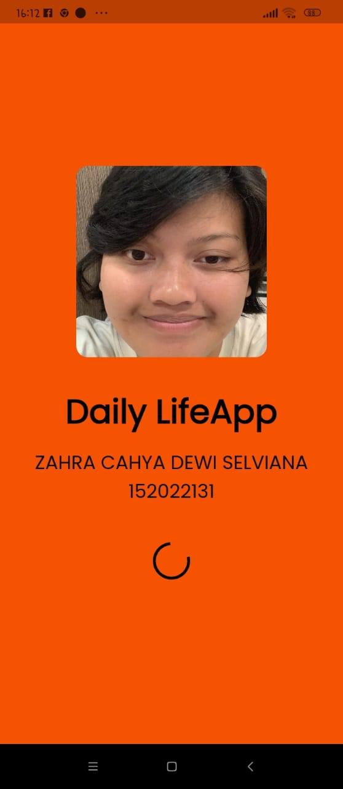
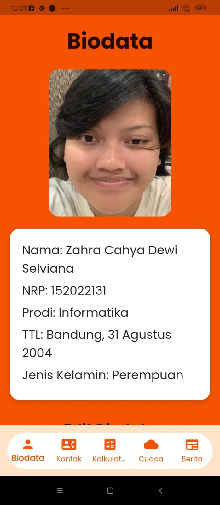
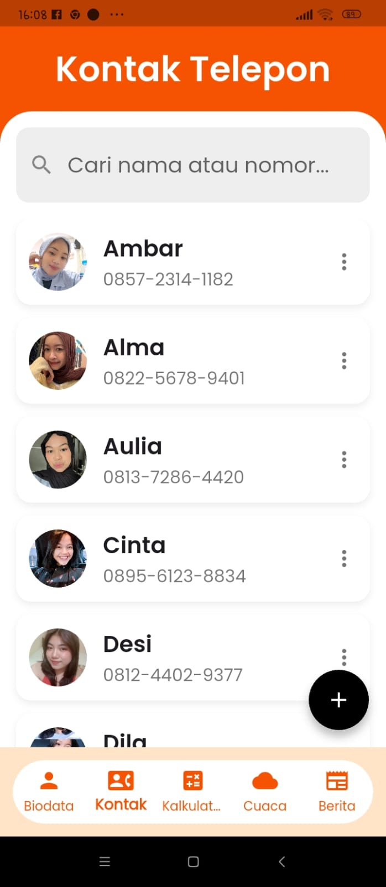
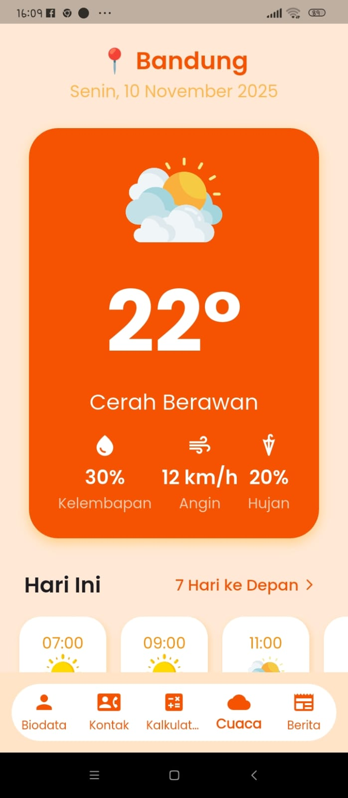
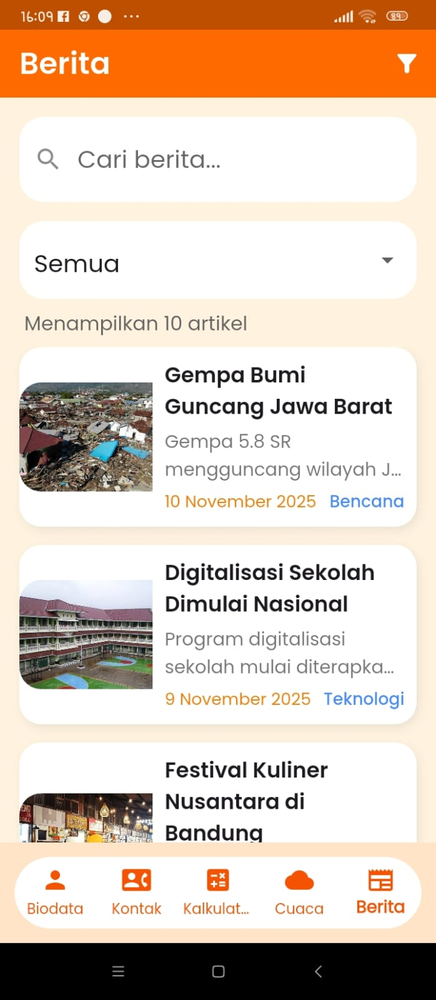

# UTS Pemrograman Mobile - Aplikasi Flutter

---

## Deskripsi Aplikasi – Daily LifeApp

Daily LifeApp adalah aplikasi mobile berbasis Flutter yang dikembangkan untuk memenuhi tugas UTS Pemrograman Mobile. Aplikasi ini berisi fitur-fitur sederhana yang berkaitan dengan aktivitas sehari-hari, seperti pengelolaan biodata, daftar kontak, kalkulator, informasi cuaca, dan daftar berita.

Aplikasi ini memiliki tampilan antarmuka yang bersih, navigasi yang mudah melalui bottom navigation bar, dan interaksi sederhana yang memudahkan pengguna berpindah antar halaman. Semua data yang digunakan bersifat statis (tanpa API) sehingga proses pengembangan lebih terfokus pada implementasi UI, widget, dan logika dasar Flutter.

Daily LifeApp juga menjadi media untuk menerapkan konsep-konsep Flutter, seperti penggunaan widget, state management dasar, navigasi, animation controller, list view, card layout, form input, dropdown, date picker, dan pembuatan halaman responsif.

---

## 📝 Deskripsi Halaman Aplikasi Daily LifeApp

Aplikasi memiliki beberapa halaman utama yang dapat diakses melalui **Bottom Navigation Bar**, yang menghubungkan halaman-halaman berikut:

| No    | Halaman                  | Deskripsi                                                                                                                                                                                                                                                                                     |
| ----- | ------------------------ | --------------------------------------------------------------------------------------------------------------------------------------------------------------------------------------------------------------------------------------------------------------------------------------------- |
| **1** | **Splash Screen**        | Tampilan pembuka selama 5 detik yang menampilkan judul aplikasi, foto pengguna, nama, dan NIM sebagai identitas awal sebelum masuk ke menu utama.                                                                                                                                             |
| **2** | **Dashboard / Navigasi** | Navigasi utama yang menggunakan bottom navigation bar dengan menu: **Biodata**, **Kontak**, **Kalkulator**, **Cuaca**, dan **Berita**, untuk memudahkan perpindahan antar halaman.                                                                                                            |
| **3** | **Biodata**              | Halaman profil lengkap berisi foto pengguna, input teks (Nama, NRP, Prodi), dropdown kelas (IF-A, IF-B, IF-C), radio button jenis kelamin, dan date picker untuk memilih tanggal lahir. Tersedia halaman **Edit Biodata** untuk memperbarui dan menyimpan perubahan data.                     |
| **4** | **Kontak**               | Menampilkan daftar kontak statis dengan foto profil melingkar, nama, dan nomor telepon. Dilengkapi fitur **Edit** dan **Hapus**, tombol **Tambah (+)** untuk menambah kontak baru, serta **search bar** untuk mencari kontak berdasarkan nama atau nomor.                                     |
| **5** | **Kalkulator**           | Kalkulator sederhana dengan fitur operasi: tambah (+), kurang (−), kali (×), bagi (÷), kuadrat (x²), akar (√), hapus satu digit (⌫), dan clear (C). Hasil perhitungan hanya muncul ketika tombol **“=”** ditekan.                                                                             |
| **6** | **Cuaca**                | Menampilkan informasi cuaca statis Kota Bandung dengan suhu, ikon cuaca bergerak (animasi awan), kelembapan, kecepatan angin, serta peluang hujan. Terdapat halaman **Hari Ini** dan **Cuaca 7 Hari** berisi prakiraan mingguan.                                                              |
| **7** | **Berita**               | Daftar berita statis berupa kartu berisi gambar, judul, ringkasan, tanggal, dan kategori. Dilengkapi fitur pencarian, filter kategori (Bencana, Olahraga, Teknologi, Ekonomi, Hiburan, Kuliner), serta urutkan berita berdasarkan terbaru atau terlama. Semua data bersifat statis tanpa API. |

---

## 📸 Screenshot Aplikasi

| Halaman                  | Tampilan                                                 |
| ------------------------ | -------------------------------------------------------- |
| Splash Screen            |                  |
| Dashboard                |                       |
| Biodata                  |                       |
| Edit Biodata 1           |        |
| Edit Biodata jenisklmn   |        |
| Edit Biodata kelas       |     |
| Edit Biodata tanggal     |     |
| Kontak                   |                         |
| Kontak 1                 |                   |
| Kontak 2                 |                   |
| Kontak 3                 |                   |
| Kalkulator               |           |
| Cuaca 1 (Hari Ini)       |                     |
| Cuaca (7 Hari / Lainnya) |                           |
| Berita                   |                         |
| Berita Search            |         |
| Berita Filter Kategori   |  |

> Semua desain dibuat dengan memperhatikan prinsip UI/UX yang bersih, modern, dan responsif.

---

## Teknologi yang Digunakan

1. Flutter 3.x

Framework utama yang digunakan untuk membangun aplikasi mobile lintas platform (Android dan iOS). Flutter memanfaatkan widget berbasis deklaratif untuk membuat tampilan yang fleksibel dan responsif.

2. Dart

Bahasa pemrograman utama untuk logika aplikasi, pengelolaan state, fungsi kalkulator, form input, dan struktur halaman.

3. Google Fonts Package

Digunakan untuk menerapkan tipografi khusus seperti Poppins, sehingga tampilan aplikasi lebih modern dan konsisten.

4. Material Design Components

Berbagai widget seperti AppBar, BottomNavigationBar, Card, ListTile, IconButton, TextField, DropdownButton, dan ElevatedButton digunakan untuk membangun tampilan sesuai standar Material Design.

5. Animation Controller

Digunakan untuk membuat efek animasi sederhana, seperti awan bergerak pada halaman Cuaca dan animasi transisi pada halaman tertentu.

6. Intl Package

Digunakan untuk format tanggal, terutama pada fitur Date Picker dalam halaman Biodata.

---

## Cara Menjalankan Proyek

1. Clone repository ini:
   ```bash
   git clone https://github.com/zahracahya/UTS-MOBILE-ZAHRA-CAHYA-DEWI-SELVIANA.git
   ```
